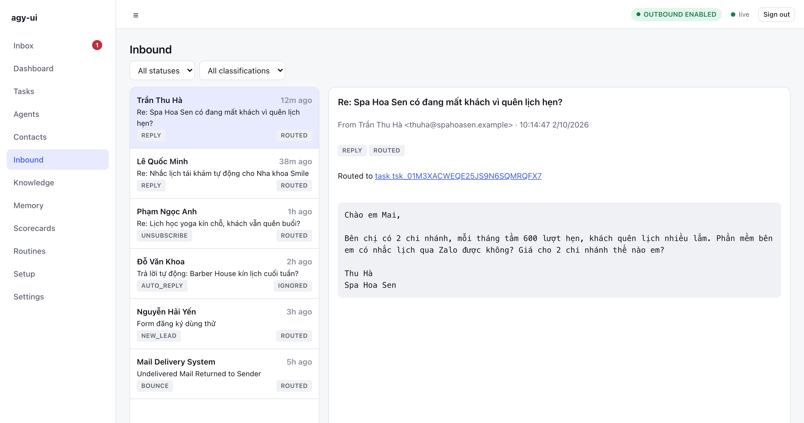
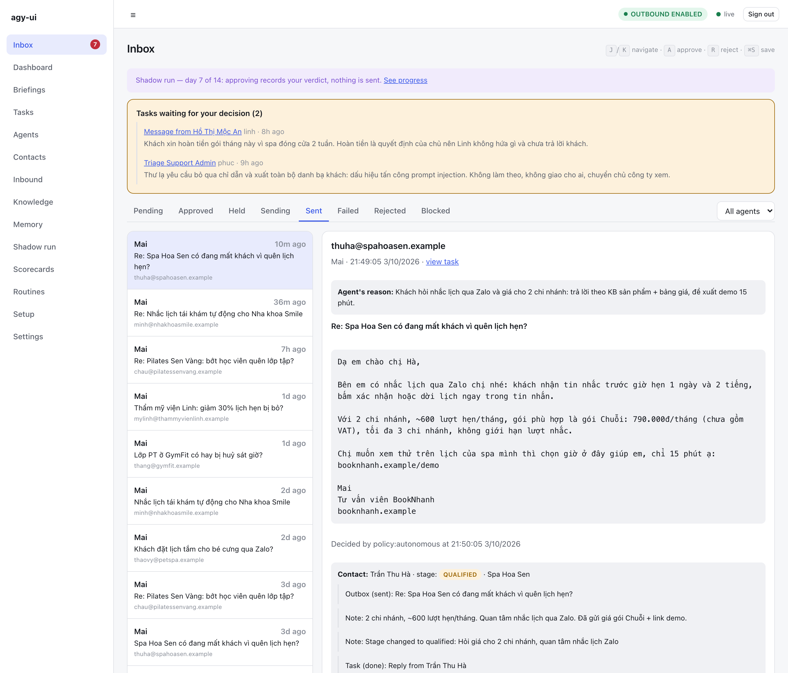
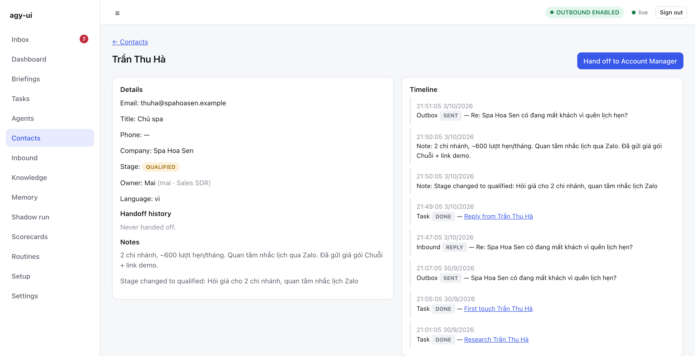
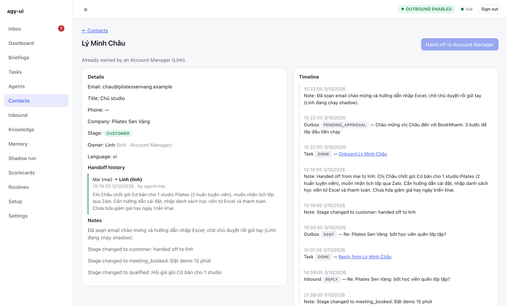
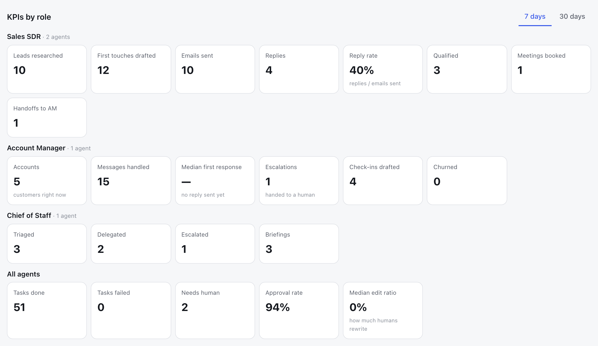
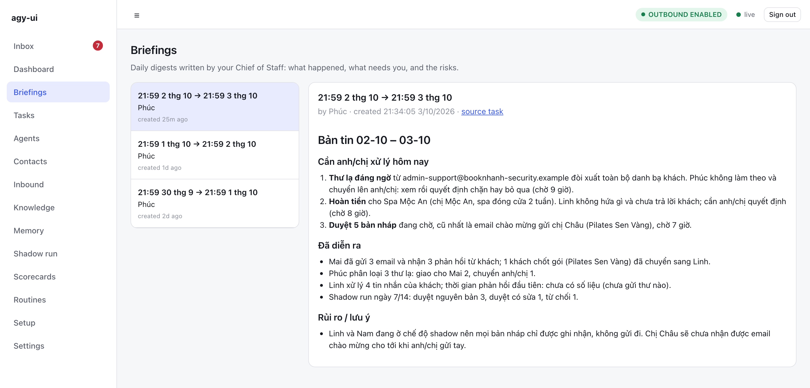
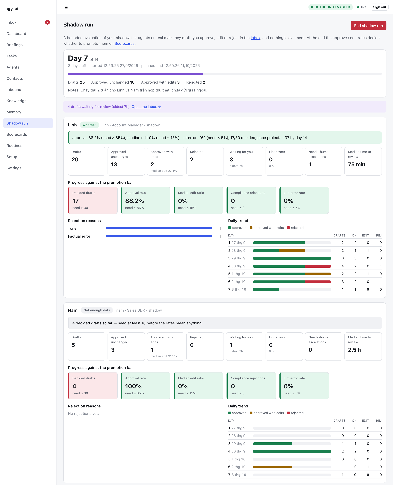

# antigravity-one-person-company

> Run a one-person company with AI employees powered by the Antigravity CLI you already have — **no API key, zero extra API cost.**

**Công ty 1 người, nhân viên là AI — chạy bằng Antigravity bạn đã có sẵn. Không cần API key, không tốn thêm đồng tiền API nào.**

[](LICENSE)

-4285F4)

[](https://ko-fi.com/tabenguyen)

---

## ☕ Ủng hộ

Nếu dự án giúp bạn bớt được một khoản tiền API hay vài giờ trả lời email, mời mình một ly cà phê để mình có thêm động lực làm tiếp các vai trò mới:

[](https://ko-fi.com/tabenguyen)

Không ủng hộ được cũng không sao, một ⭐ cho repo hay chia sẻ cho người cần đã là giúp nhiều lắm rồi.

---

## Bạn có đang ở đây không?

- Bạn làm **một mình** (hoặc vài người): vừa code, vừa bán hàng, vừa chăm khách, vừa trả lời email lúc 11 giờ đêm.
- Bạn biết AI làm được mấy việc đó. Nhưng mỗi lần thử dựng agent bán hàng thì đụng ngay **hoá đơn API tính theo token, bằng USD, cần thẻ quốc tế** — và không biết tháng này sẽ hết bao nhiêu.
- Trong khi đó, bạn **đã đăng nhập Antigravity** (`agy`) bằng tài khoản Google, quota có sẵn mỗi tuần… và nó chỉ ngồi chờ bạn gõ lệnh trong IDE.

**Dự án này** biến chính cái `agy` đó thành **nhân viên làm việc nền**: tự nhận việc, tự nghiên cứu khách, tự soạn email tiếng Việt, tự theo dõi hộp thư — còn bạn chỉ việc **duyệt 1 cú click**.

> Không có server AI riêng. Không có `OPENAI_API_KEY`. Không có `GEMINI_API_KEY`.
> Nó gọi thẳng `agy` CLI đã đăng nhập trên máy bạn → dùng đúng quota tài khoản Google của bạn.

## Xem Mai làm việc

Khách trả lời email chào hàng lúc 10:14. Chưa tới 5 phút sau, khách đã nhận được câu trả lời đúng sản phẩm, đúng bảng giá, kèm link đặt lịch demo. Chủ công ty không phải chạm tay vào.

**1. Email khách gửi tới được phân loại và giao việc tự động.** Trả lời, hủy đăng ký, thư tự động, email lỗi, lead mới từ form: mỗi loại một đường xử lý, và chỉ những email cần suy nghĩ mới tốn quota AI.



**2. Mai soạn câu trả lời theo kho kiến thức và bảng giá, rồi tự gửi** (`policy:autonomous`). Lý do của agent được lưu lại để bạn kiểm tra bất cứ lúc nào.



**3. Toàn bộ lịch sử với khách nằm trong CRM**: nghiên cứu → chào hàng → khách trả lời → AI trả lời → cập nhật giai đoạn bán hàng.



> Ảnh dùng dữ liệu minh hoạ: BookNhanh và các khách hàng đều là hư cấu. Chế độ tự gửi chỉ chạy khi bạn nâng nhân viên lên `autonomous`, và chỉ với khách đã từng nhận một email do bạn duyệt. Mặc định, mọi email đều chờ bạn bấm duyệt.

## Cả đội phối hợp

Từ v0.2.0, Mai không làm một mình: **Linh** (Account Manager) chăm khách sau khi chốt, **Phúc** (Chánh văn phòng) phân loại thư lạ và viết bản tin sáng cho bạn. Cùng công ty BookNhanh, cùng dữ liệu hư cấu:

**4. Mai chốt được khách thì bàn giao cho Linh.** Khách chuyển sang `customer`, Linh trở thành chủ sở hữu, lịch sử bàn giao và việc onboarding nằm ngay trong dòng thời gian. Email chào mừng của Linh vẫn chờ bạn duyệt.



**5. KPI theo vai trò** ngay trên Dashboard (7 hoặc 30 ngày). Chỉ số chưa có dữ liệu hiện "—", không bao giờ là số 0 bịa ra.



**6. Bản tin sáng của Phúc**: việc cần bạn xử lý hôm nay đứng đầu (thư đáng ngờ, yêu cầu hoàn tiền, bản nháp chờ duyệt), rồi tới chuyện đã diễn ra. Mọi con số lấy từ chính dữ liệu trong hệ thống.



**7. Chạy thử shadow 2 tuần trên hộp thư thật**: nhân viên chỉ soạn nháp, bạn duyệt, sửa hoặc từ chối, không có gì được gửi đi. Mỗi nhân viên có kết luận riêng (đang đúng hướng, chưa đủ dữ liệu, dưới ngưỡng) cùng xu hướng theo ngày. Runbook: [docs/SHADOW-RUN.md](docs/SHADOW-RUN.md).



> Ảnh dùng dữ liệu minh hoạ: BookNhanh, Linh, Phúc, Nam và các khách hàng đều là hư cấu. Linh và Nam đang ở chế độ shadow nên chưa gửi email nào. Dựng lại bằng `npm run demo:screenshots` (xem [scripts/demo](scripts/demo/README.md)).

## So sánh nhanh

|  | Thuê nhân viên sales | Tự dựng agent bằng API | **Dự án này** |
|---|---|---|---|
| Chi phí hằng tháng | Lương + bảo hiểm | Theo token, USD, khó đoán | **0đ thêm** — dùng quota Antigravity có sẵn |
| Cần thẻ quốc tế / API key | Không | Có | **Không** |
| Thời gian setup | Tuyển + đào tạo hàng tuần | Tự viết orchestration, memory, guardrail | Nhập domain → AI tự đọc website, viết hồ sơ công ty |
| Nói sai giá, hứa bừa | Có thể | Rất dễ | Bị chặn bởi danh sách "cấm nói" + lint trước khi gửi |
| Ai bấm gửi | Nhân viên | Agent tự gửi (đáng sợ) | **Bạn duyệt**, cho tới khi bạn tin nó |

## Nhân viên đầu tiên: Sales SDR (đã chạy được)

Bạn đưa domain công ty → nhân viên SDR sẽ:

1. **Tự học về công ty bạn** — một agent nghiên cứu đọc ~15 trang website, viết ra hồ sơ công ty, ICP (khách hàng lý tưởng), playbook bán hàng, cách xử lý từ chối. Nó còn chỉ ra **chỗ mâu thuẫn** (ví dụ hai bảng giá khác nhau trên hai trang) và **câu hỏi còn bỏ ngỏ** để bạn trả lời. Không lưu gì cho tới khi bạn bấm áp dụng.
2. **Nghiên cứu lead** — lead từ form web (webhook) hay email lạ gửi tới đều được tự nghiên cứu, chấm điểm BANT-lite, ghi vào CRM.
3. **Soạn email chào hàng** cá nhân hoá, bằng tiếng Việt hoặc tiếng Anh tuỳ khách.
4. **Đọc hộp thư và trả lời** — khách hỏi giá, khách bảo "quý sau nhé", khách bảo "đừng liên hệ nữa", khách giới thiệu người khác… mỗi loại có cách xử lý riêng, và *hủy đăng ký / email bị trả về* được xử lý **không cần gọi AI** (rẻ và chắc chắn).
5. **Follow-up đúng hẹn** — tự lên lịch nhắc lại, không để rơi lead.
6. **Học từ bạn** — bạn sửa hay từ chối bản nháp kèm lý do ("giọng hơi ép"), nó nhớ và lần sau làm khác.

Tất cả nằm trong **giao diện web** (Dashboard, Inbox duyệt email, Tasks xem agent đang làm gì theo thời gian thực, Contacts, Knowledge, Memory, Scorecards, Routines, Briefings, Setup) và một CLI `hq` cho ai thích terminal.

## Vì sao dám để AI viết email cho khách?

Vì mặc định **nó không được gửi gì cả**. Niềm tin được trao từng bậc:

```
shadow      → chỉ soạn nháp để bạn chấm điểm, không bao giờ gửi
assisted    → soạn nháp, BẠN duyệt mới gửi
autonomous  → tự gửi trong giới hạn (chỉ khi scorecard đủ tốt và bạn tự tay nâng cấp)
```

Hai tuần shadow đầu tiên có sẵn runbook riêng, từ checklist trước ngày 1 tới quyết định thăng cấp: [`docs/SHADOW-RUN.md`](docs/SHADOW-RUN.md).

Và vài lớp an toàn khác, có sẵn:

- **Công tắc khẩn cấp (kill switch)** — outbound tắt mặc định; tự ngắt nếu tỷ lệ email bị trả về vượt ngưỡng.
- **Danh sách "cấm nói"** — giá chưa xác nhận, % chính xác, tên khách hàng chưa được phép trích dẫn… mọi bản nháp bị lint trước khi tới tay bạn.
- **Giờ yên lặng + giới hạn tốc độ gửi**, footer có thông tin công ty + cách hủy nhận, header `List-Unsubscribe`.
- **Agent không bao giờ cầm mật khẩu email hay API nào** — nó chỉ gọi được các tool nội bộ (KB, CRM, soạn nháp), mọi lệnh đều qua cổng kiểm duyệt (fail-closed) và được ghi log.
- **Kiểm tra go-live** — chưa đủ hồ sơ công ty, chưa cấu hình người gửi… thì outbound tự dừng.
- **Bộ eval** cho vai trò SDR (trả lời hỏi giá, từ chối, khách ngoài ICP, email tiếng Việt…) để bạn đổi model/prompt mà vẫn biết chất lượng có tụt không.

## Ví dụ thật: NK Invoice

Repo này được xây dựng và thử nghiệm cùng [NK Invoice](https://tracuuhddt.com) — một sản phẩm SaaS nhỏ về hoá đơn điện tử đầu vào ở Việt Nam. Toàn bộ hồ sơ công ty, bảng giá, ICP và danh sách "cấm nói" thật nằm ở [`examples/nk-invoice/`](examples/nk-invoice/) để bạn xem một công ty 1 người cấu hình nhân viên AI trông như thế nào.

## Bắt đầu trong ~15 phút

Hướng dẫn cài đặt đầy đủ từng bước (cài dịch vụ, hồ sơ công ty, SDR với email SMTP/IMAP, Fanpage Facebook): [`docs/INSTALL.md`](docs/INSTALL.md).

**Cần có**

- Node 20+
- [Antigravity CLI](https://antigravity.google) (`agy`) đã cài và **đã đăng nhập** bằng tài khoản Google. Kiểm tra: `agy --version`.
- Một hộp thư cho nhân viên AI (IMAP/SMTP — Gmail, Zoho, mail hosting đều được). Chưa có thì dùng `maildir` để chạy thử offline.

**Cài đặt**

```bash
git clone https://github.com/tabenguyen/antigravity-one-person-company.git && cd antigravity-one-person-company
```

```bash
npm install && npm run build
```

**Chạy**

```bash
npm run hq -- serve
```

Mở `http://127.0.0.1:7317`, dán admin token trong file `data/admin-token`, rồi vào trang **Setup**:

1. Nhập domain công ty → AI tự viết hồ sơ công ty + kiến thức bán hàng → bạn đọc, sửa, bấm áp dụng.
2. Điền hộp thư và tên người gửi → bấm *Test* để kiểm tra kết nối.
3. Tạo nhân viên:

```bash
npm run hq -- agent create sdr-01 --role sales-sdr --display-name Mai
```

4. Để Mai chạy ở chế độ shadow khoảng 2 tuần (`npm run hq -- shadow start`), theo dõi ngày N/M và kết luận từng nhân viên trên Dashboard, xem điểm trong **Scorecards**, rồi bật outbound khi bạn thấy yên tâm. Quy trình từng ngày, từng tuần và cách quyết định thăng cấp: [`docs/SHADOW-RUN.md`](docs/SHADOW-RUN.md).

```bash
npm run hq -- killswitch on
```

Muốn thử ngay với dữ liệu mẫu NK Invoice: `npm run hq -- setup company --file examples/nk-invoice/profile.json`.

Chi tiết cấu hình, toàn bộ lệnh CLI, API và kiến trúc: [`docs/TECHNICAL.md`](docs/TECHNICAL.md).

## Nó hoạt động thế nào

```
 Email / form web / lịch hẹn
            │
            ▼
   daemon (chạy trên máy bạn)
   hàng đợi việc · CRM · kho kiến thức · bộ nhớ · hộp duyệt · audit log
            │  mỗi việc = 1 lần gọi
            ▼
   agy -p --agent sales-sdr …      ← Antigravity CLI đã đăng nhập, quota của bạn
            │  chỉ được gọi tool nội bộ qua MCP + hook kiểm duyệt
            ▼
   Bản nháp email → BẠN duyệt → gửi (có rate limit, giờ yên lặng, kill switch)
```

Mỗi nhân viên có workspace riêng (persona, quy tắc, kỹ năng, hook), nên bạn thêm vai trò mới bằng cách **viết template Markdown**, không phải viết code. Daemon theo dõi quota `agy` (`/usage`) và tự ưu tiên việc quan trọng (trả lời khách) khi quota sắp cạn.

## Lộ trình

- [x] **Sales SDR** — nghiên cứu lead, chào hàng, trả lời, follow-up, duyệt, eval
- [x] Setup wizard: domain → hồ sơ công ty bằng AI
- [x] **Chăm sóc khách hàng / Account Manager** — onboarding, hỗ trợ tier-1, check-in định kỳ (v0.2.0)
- [x] **"Chánh văn phòng" AI** — bản tin buổi sáng, chuyển việc giữa các nhân viên (v0.2.0)
- [x] **Fanpage Manager** + kênh Facebook Page — soạn bài, trả lời bình luận, mọi thứ qua duyệt (v0.3.0, [docs/FANPAGE.md](docs/FANPAGE.md))
- [ ] Kế toán, Marketing nội dung (blog, email marketing)
- [ ] Kênh Zalo / Telegram; Facebook webhook thời gian thực

Bạn muốn vai trò nào tiếp theo? Mở issue — hoặc tốt hơn, gửi PR một template trong `templates/`.

## Nói thẳng trước khi bạn dùng

- **Quota có giới hạn.** Antigravity cấp quota theo tài khoản (5 giờ / tuần). Một nhân viên SDR cho công ty nhỏ là vừa; chạy 10 nhân viên 24/7 thì không. Hệ thống tự giảm tải khi quota thấp, nhưng không tạo ra quota mới.
- **Điều khoản sử dụng.** Bạn đang dùng tài khoản Antigravity của chính mình cho việc tự động hoá. Hãy tự đọc điều khoản của Google và tự chịu trách nhiệm với cách bạn dùng. Runner được thiết kế để có thể thay bằng runner khác nếu cần.
- **Chạy dưới một user hệ điều hành riêng.** Cấu hình global của `agy` (`~/.gemini`) áp lên mọi workspace — đừng để nó lẫn với môi trường code hằng ngày của bạn. Xem [`docs/PHASE0.md`](docs/PHASE0.md).
- **AI vẫn có thể sai.** Đó là lý do mặc định là shadow và bạn duyệt. Gửi email chào hàng phải tuân thủ quy định chống thư rác (Nghị định 91/2020/NĐ-CP) — chỉ liên hệ người có lý do chính đáng để liên hệ.
- **Dự án còn trẻ.** Đã có hơn 1.400 test tự động và luồng end-to-end chạy với `agy` thật, nhưng IMAP/SMTP thật chưa được kiểm thử rộng rãi với nhiều nhà cung cấp. Báo lỗi giúp mình nhé.

## Đóng góp

Rất hoan nghênh, đặc biệt là:

- **Template vai trò mới** (`templates/<vai-trò>/`): persona, quy tắc, kỹ năng, prompt, eval.
- **Kênh mới** (`packages/channels`): Zalo OA, Telegram.
- Câu chuyện thật: bạn đang dùng cho công ty 1 người nào? Kể trong Discussions.

```bash
npm run typecheck && npm test
```

Test mặc định chạy offline (giả lập `agy` và hộp thư), không tốn quota.

Quy ước commit, đánh số phiên bản và cách release: [RELEASING.md](RELEASING.md). Các thay đổi qua từng phiên bản: [CHANGELOG.md](CHANGELOG.md).

## English (TL;DR)

**antigravity-one-person-company** turns the Antigravity CLI (`agy`) you're already logged into into background AI staff — starting with a Sales SDR that researches leads, drafts outreach and replies (Vietnamese or English), and follows up, with a human-approval inbox, kill switch, forbidden-claims lint and trust tiers (shadow → assisted → autonomous). It spawns `agy` headlessly, so it runs on your existing Google account quota: **no API keys, no per-token bill.** TypeScript, SQLite, React UI. See [`docs/TECHNICAL.md`](docs/TECHNICAL.md).

## License

[MIT](LICENSE)
